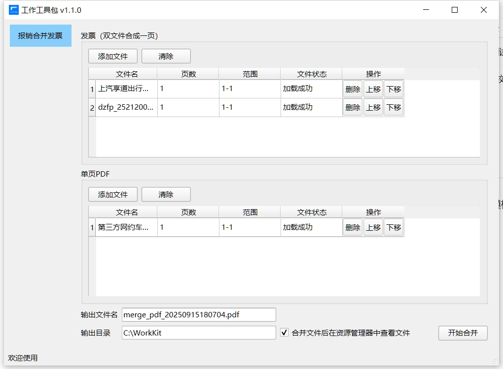

# WorkKit

[]()
[]()

---
WorkKit 是一款基于python3.10 和 PySide6 构建的办公工具包。主要处理办公过程中遇到的问题。

界面预览:


## Installation

```bash
poetry install
```

## Usage

```bash
python src/main.py
```

## Build

```bash
```

## Architecture
